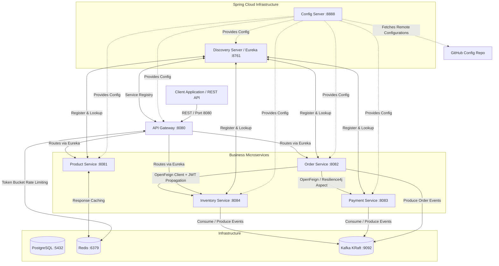
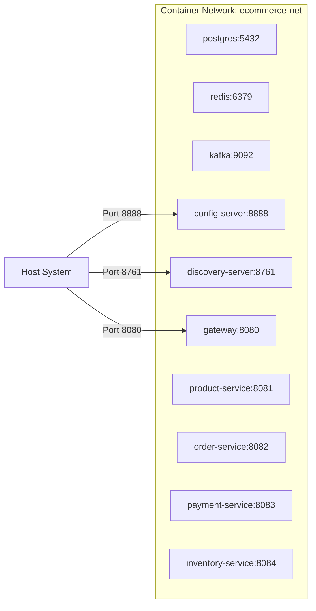
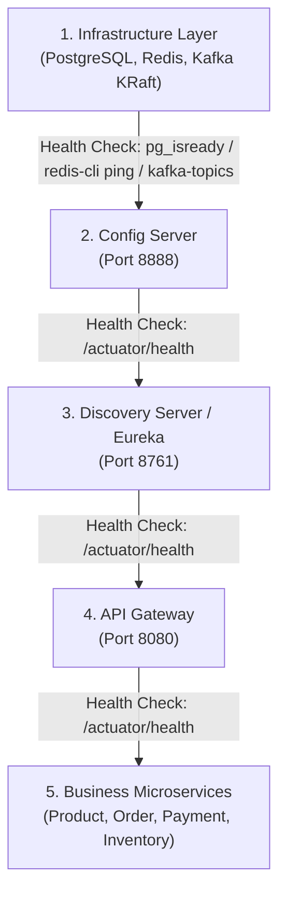

# Enterprise Ecommerce Microservices Platform — Production Docker Containerization

This repository contains an enterprise-grade Spring Boot 3 & Spring Cloud microservices platform containerized for production deployment. The architecture provides dynamic discovery, centralized configuration, single entry-point API gateway routing, resilient inter-service communication (OpenFeign & Resilience4j), asynchronous event streaming via Apache Kafka (KRaft mode), and Redis caching/rate limiting.

---

## 🏗️ System Architecture Overview



---

## 🐳 Docker Architecture & Container Topology

All infrastructure containers and Spring Boot microservices are orchestrated inside a single private Docker bridge network (`ecommerce-net`), communicating seamlessly via container hostnames.



---

## 🔄 Container Startup & Dependency Order

The platform enforces strict startup order through Docker Compose health check conditions (`condition: service_healthy`):



---

## 📦 Multi-Stage Build Strategy & Optimization

Every microservice uses an optimized two-stage Dockerfile built on Eclipse Temurin Java 21:

1. **Stage 1 (Builder Stage - Maven & JDK 21)**:
   - Uses `maven:3.9.6-eclipse-temurin-21-alpine`.
   - Leverages Docker layer caching: copies `pom.xml` first and downloads dependencies offline (`mvn dependency:go-offline`).
   - Copies source code and compiles executable JAR (`mvn clean package -DskipTests`).
2. **Stage 2 (Runtime Stage - JRE 21 Only)**:
   - Uses ultra-minimal JRE runtime `eclipse-temurin:21-jre-alpine`.
   - Copies **ONLY** the compiled fat JAR from the builder stage (`COPY --from=builder /app/target/*.jar app.jar`).
   - Contains **no source code, no tests, no build tools, and no Maven cache**.
   - Runs as a non-privileged system user (`appuser:appgroup`, UID 10001) for strict security compliance.

---

## 🔌 Service Port Registry & Health Endpoints

| Service Name | Container Name | Port | Health Check Endpoint | Description |
| :--- | :--- | :---: | :--- | :--- |
| **PostgreSQL** | `postgres` | `5432` | `pg_isready -U postgres` | Database for persistent storage |
| **Redis** | `redis` | `6379` | `redis-cli ping` | Cache & Gateway Rate Limiting token store |
| **Kafka (KRaft)** | `kafka` | `9092` | `kafka-topics --list` | Event streaming broker (KRaft mode) |
| **Config Server** | `config-server` | `8888` | `/actuator/health` | Centralized Configuration Server |
| **Discovery Server**| `discovery-server`| `8761` | `/actuator/health` | Eureka Service Registry |
| **API Gateway** | `gateway` | `8080` | `/actuator/health` | API Gateway, Routing & Token Rate Limiter |
| **Product Service** | `product-service` | `8081` | `/actuator/health` | Product catalog with Redis caching |
| **Order Service** | `order-service` | `8082` | `/actuator/health` | Order orchestration & OpenFeign integration |
| **Payment Service** | `payment-service` | `8083` | `/actuator/health` | Billing & payment processing |
| **Inventory Service**| `inventory-service`| `8084` | `/actuator/health` | Stock availability & reservation |

---

## 🌐 Environment Variables Configuration

| Variable Name | Default / Container Value | Purpose |
| :--- | :--- | :--- |
| `SPRING_PROFILES_ACTIVE` | `docker` | Activates Docker Spring profile |
| `SPRING_CONFIG_IMPORT` | `optional:configserver:http://config-server:8888` | Config Server URI |
| `EUREKA_CLIENT_SERVICEURL_DEFAULTZONE` | `http://discovery-server:8761/eureka/` | Eureka Discovery URI |
| `SPRING_DATA_REDIS_HOST` | `redis` | Redis container hostname |
| `SPRING_DATA_REDIS_PORT` | `6379` | Redis port |
| `SPRING_KAFKA_BOOTSTRAP_SERVERS` | `kafka:9092` | Kafka broker endpoint |
| `JWT_SECRET` | `microservices-pro-course-secret-key-2024...` | Secret key for JWT verification |

---

## 💾 Docker Volumes

Persistent storage is guaranteed across container restarts via dedicated named volumes:
- `postgres_data`: Persists PostgreSQL database state (`/var/lib/postgresql/data`).
- `redis_data`: Persists Redis key-value snapshots (`/data`).
- `kafka_data`: Persists Kafka topics and event log segments (`/var/lib/kafka/data`).

---

## 🚀 Build & Run Instructions

### 1. Build and Launch Full Platform (Single Command)
Run from the project root:
```bash
docker compose up --build -d
```

### 2. Check Container Health Status
```bash
docker compose ps
```

### 3. Stream Container Logs
Stream all logs:
```bash
docker compose logs -f
```
Stream logs for a specific service:
```bash
docker compose logs -f order-service
```

### 4. Stop Platform
Stop container services while preserving volumes:
```bash
docker compose down
```

### 5. Stop Platform & Remove Volumes
Stop container services and purge all data volumes:
```bash
docker compose down -v
```

### 6. Rebuild Single Service
If you edit code in a service (e.g. `order-service`):
```bash
docker compose up --build -d order-service
```

---

## 🧪 Verification & End-to-End Testing

Once `docker compose ps` shows all services are **healthy**:

### 1. Check Service Registry (Eureka Dashboard)
Open browser: `http://localhost:8761`
All business services (`PRODUCT-SERVICE`, `ORDER-SERVICE`, `PAYMENT-SERVICE`, `INVENTORY-SERVICE`, `API-GATEWAY`) should appear registered.

### 2. Check Gateway Health
```bash
curl -X GET http://localhost:8080/actuator/health
```

### 3. Test Inventory Stock Check (via Gateway)
```bash
curl -X GET "http://localhost:8080/api/v1/inventory/check?productId=PROD-001&quantity=5"
```

### 4. Create Order (Success Flow via Gateway)
```bash
curl -X POST "http://localhost:8080/api/orders" \
  -H "Content-Type: application/json" \
  -d '{"productId": "PROD-001", "quantity": 5, "amount": 100.00}'
```

---

## 🛠️ Troubleshooting Guide

> [!TIP]
> **Issue: Service fails to connect to Config Server or Eureka**  
> **Resolution:** Ensure `config-server` has passed its health check first (`docker compose ps`). Microservices rely on `depends_on: condition: service_healthy` to delay startup until infrastructure endpoints are responsive.

> [!TIP]
> **Issue: Out of Memory during Docker Build**  
> **Resolution:** Ensure Docker Desktop / Engine has allocated at least 4GB of RAM (6GB+ recommended) for concurrent multi-stage Maven builds. Alternatively, build services individually using `docker compose build <service-name>`.

> [!TIP]
> **Issue: Kafka connection failure**  
> **Resolution:** Inter-container calls must use `kafka:9092`. Host calls outside Docker should use `localhost:29092`.

---
