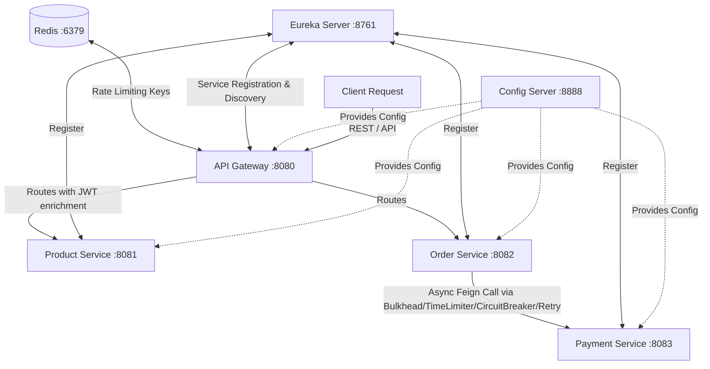

<<<<<<< Updated upstream
# Ecommerce Project

=======
# Ecommerce Project — Microservices Architecture & Resilience Patterns (Session 5)

This repository contains a Spring Boot & Spring Cloud microservices training project. Session 5 introduces an advanced asynchronous resilience layer in the `order-service` to manage downstream execution, concurrency, and timeouts using Resilience4j.

---

## 🏗️ Architecture Overview

The system is organized into a **4-tier microservices architecture** where the API Gateway acts as the single entry point and security trust boundary. 



---

## 🔌 Service Port Registry

| Service Name | Port | Database / Backend | Key Functions |
| :--- | :---: | :--- | :--- |
| **`api-gateway`** | `8080` | Redis (`localhost:6379`) | API Gateway, Route Matching, JWT Authentication, Logging, Rate Limiting |
| **`eureka`** | `8761` | In-Memory Registry | Netflix Eureka Service Registry & Discovery |
| **`config-server`** | `8888` | Local Git Repository | Central Config Server (Fetches configs from `config-repo` directory) |
| **`product`** | `8081` | H2 DB (`jdbc:h2:mem:productdb`) | Product Catalog Management (CRUD) |
| **`order-service`** | `8082` | H2 DB (`jdbc:h2:mem:orderdb`) | Order service with asynchronous execution and Resilience4j Aspect stack |
| **`payment-service`**| `8083` | H2 DB (`jdbc:h2:mem:paymentdb`) | Payment service with dynamic delay and failure rate simulator |

---

## 🛡️ Security & JWT Architecture

This project enforces a **Single Security Trust Boundary** pattern:
1. **Validation at Gateway Only:** The API Gateway validates incoming JWT tokens. Downstream services do **not** perform JWT verification.
2. **Header Cleansing:** The Gateway strips any incoming headers like `X-User-Id` or `X-User-Role` from clients to prevent request-spoofing.
3. **Header Enrichment:** Once the JWT is verified, the Gateway extracts claims (User ID and Role) and injects them into the HTTP headers (`X-User-Id`, `X-User-Role`) passed downstream.

---

## 🚦 Request Rate Limiting

The API Gateway integrates **Spring Cloud Gateway RequestRateLimiter** backed by Redis:
* **Default IP-based Limiting:** `ipKeyResolver` limits calls by client IP to prevent denial of service (DoS).
* **User-based Limiting:** `userKeyResolver` extracts `X-User-Id` to apply custom rate limits per authenticated user.

---

## ⚡ Asynchronous Resilience Layer (Session 5)

To protect `order-service` from resource starvation and slow/failing downstream dependencies (`payment-service`), we implemented a non-blocking asynchronous resilience stack using **Resilience4j**, **Spring AOP**, and **Java CompletableFuture**.

### 1. Request Flow & Execution Order
When a request is sent to `POST /api/orders`:
```
[Client] -> [OrderController] -> [Bulkhead (1)] -> [TimeLimiter (2)] -> [Circuit Breaker (3)] -> [Retry (4)] -> [Async Task (CompletableFuture)] -> [Payment Service]
```
The aspect execution order is enforced programmatically in [ResilienceAspectConfig.java](file:///order-service/src/main/java/com/microservice/pro/order_service/config/ResilienceAspectConfig.java):
* **Bulkhead (Precedence 1):** Semaphore Bulkhead limits the maximum concurrent active payment processing threads.
* **TimeLimiter (Precedence 2):** Restricts the maximum time allowed for the task execution.
* **Circuit Breaker (Precedence 3):** Monitors failures and short-circuits calls when threshold is crossed.
* **Retry (Precedence 4):** Retries failed calls with exponential backoff before reporting failure.

### 2. Specific Fallback Paths
Each resilience decorator provides a customized fallback path:
* **Bulkhead Fallback:** Executed when concurrent calls exceed limits. Returns `QUEUED` status with message `"System busy. Your order has been queued."` and logs a warning with prefix `[BULKHEAD]`.
* **TimeLimiter Fallback:** Executed when downstream payment takes longer than 2s. Returns `PENDING` status with message `"Payment timed out."` and logs a warning with prefix `[TIMEOUT]`.
* **Circuit Breaker / Retry Fallback:** Executed when retries are exhausted or the circuit is OPEN. Returns `PENDING` status with message `"Payment unavailable."`.

### 3. Dynamic Payment Simulator
The `payment-service` simulates failure rates and processing delays controlled by the Central Config Server properties:
* `payment.failure-rate`: Failure rate fraction (e.g., `0.5` for 50%).
* `payment.delay-ms`: Time in milliseconds to block the thread (e.g., `3000` to simulate a 3-second delay).

---

## ⚙️ Resilience & Actuator Configurations

Configurations are centralized in [order-service.yml](file:///config-repo/order-service.yml) inside the local Git config repository:
```yaml
resilience4j:
  bulkhead:
    instances:
      paymentService:
        max-concurrent-calls: 10
        max-wait-duration: 0ms
  timelimiter:
    instances:
      paymentService:
        timeout-duration: 2s
        cancel-running-future: true
  circuitbreaker:
    instances:
      paymentService:
        sliding-window-type: COUNT_BASED
        sliding-window-size: 10
        failure-rate-threshold: 50
        wait-duration-in-open-state: 5s
        permitted-number-of-calls-in-half-open-state: 3
        automatic-transition-from-open-to-half-open-enabled: true
        register-health-indicator: true
  retry:
    instances:
      paymentService:
        max-attempts: 3
        wait-duration: 500ms
        enable-exponential-backoff: true
        exponential-backoff-multiplier: 2

management:
  health:
    circuitbreakers:
      enabled: true
    bulkheads:
      enabled: true
  endpoints:
    web:
      exposure:
        include: health,info,circuitbreakers,bulkheads,metrics
```

---

## 🛠️ Startup & Verification Guide

### 1. Pre-requisites
* **Java 21**
* **Redis** (running on `localhost:6379`)

### 2. Startup order
1. **Config Server** (Port `8888`)
2. **Eureka Registry** (Port `8761`)
3. **Payment Service** (Port `8083`)
4. **Order Service** (Port `8082`)
5. **API Gateway** (Port `8080`)

### 3. Verification Scripts
Helper PowerShell scripts are located in the [test-scripts](file:///test-scripts/) directory:
* **Timeout Verification:** [timeout_test.ps1](file:///test-scripts/timeout_test.ps1) sets `payment.delay-ms` to `3000` to trigger the timeout fallback.
* **Bulkhead Concurrency Verification:** [concurrent_test.ps1](file:///test-scripts/concurrent_test.ps1) fires 15 concurrent HTTP requests to trigger the bulkhead queueing fallback.

---

## 🧪 Running Automated Tests

Run the test suite using the Maven Wrapper from the root of `order-service` or `payment-service`:
```bash
# In order-service
.\mvnw.cmd clean test

# In payment-service
.\mvnw.cmd clean test
```
The test suite validates:
* **Bulkhead Limitation:** Programmatic concurrent task executor validates bulkhead rejection and fallback message mapping.
* **TimeLimiter Timeout:** WireMock injects delays to trigger timeout fallback.
* **Retry & Circuit Breaker:** Validates exponential backoff retries and subsequent circuit opening.
>>>>>>> Stashed changes
