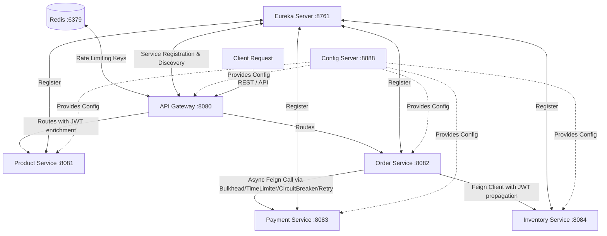
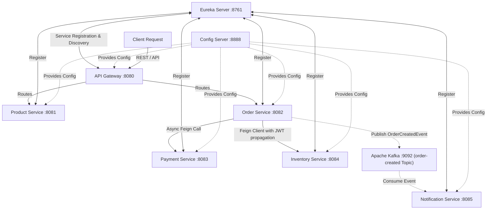

# Ecommerce Project — Microservices Architecture, Resilience & OpenFeign (Session 6)

This repository contains a Spring Boot & Spring Cloud microservices training project. Session 6 extends the platform by implementing synchronous service-to-service communication using OpenFeign, incorporating JWT token propagation via request interceptors, custom error decoding, and integrating a new Inventory microservice.

---

## 🏗️ Architecture Overview

The system is organized into a **4-tier microservices architecture** where the API Gateway acts as the single entry point and security trust boundary.



---

## 🔌 Service Port Registry

| Service Name | Port | Database / Backend | Key Functions |
| :--- | :---: | :--- | :--- |
| **`api-gateway`** | `8080` | Redis (`localhost:6379`) | API Gateway, Route Matching, JWT Authentication, Logging, Rate Limiting |
| **`eureka`** | `8761` | In-Memory Registry | Netflix Eureka Service Registry & Discovery |
| **`config-server`** | `8888` | Local Git Repository | Central Config Server (Fetches configs from `config-repo` directory) |
| **`product`** | `8081` | H2 DB (`jdbc:h2:mem:productdb`) | Product Catalog Management (CRUD) |
| **`order-service`** | `8082` | H2 DB (`jdbc:h2:mem:orderdb`) | Handles orders; integrates Feign clients for Inventory and Payment |
| **`payment-service`**| `8083` | H2 DB (`jdbc:h2:mem:paymentdb`) | Billing service with simulated latency and failure injection |
| **`inventory-service`**| `8084`| In-Memory Map | Manage stock availability and check limits |

---

## 🛡️ Security & JWT Propagation
1. **Validation at Gateway:** The API Gateway validates incoming JWT tokens. Downstream services do **not** perform JWT verification.
2. **Header Enrichment:** Once the JWT is verified, the Gateway extracts claims (User ID and Role) and injects them into the HTTP headers (`X-User-Id`, `X-User-Role`) passed downstream.
3. **JWT Propagation Interceptor:** When `order-service` makes internal Feign calls to `inventory-service` or `payment-service`, the `FeignJwtInterceptor` automatically forwards the `Authorization` header from the current request thread, preserving user context across the entire call chain.

---

## 📦 Inventory Service Domain & Data
* **StockItem (Java Record):** Models immutable data with fields `productId`, `availableQuantity`, and `reservedQuantity`, containing a utility method `hasStock(requested)`.
* **Database Representation:** A thread-safe `ConcurrentHashMap` in-memory store pre-populated with:
  * `PROD-001` — Available: 100, Reserved: 0
  - `PROD-002` — Available: 5, Reserved: 0
  - `PROD-003` — Available: 0, Reserved: 0
* **Endpoint:** `GET /api/v1/inventory/check?productId=...&quantity=...`
  * Returns `200 OK` if stock is available.
  * Returns `409 Conflict` (via `InsufficientStockException`) if stock is insufficient.
  * Returns `404 Not Found` (via `ProductNotFoundException`) if the product is not found.

---

## 🔗 OpenFeign Integration & Business Flow

The platform uses **OpenFeign** for service-to-service calls.

### Execution Flow:
When a client requests order creation:
1. `Client` -> `Gateway` -> `Order Service` (`POST /api/orders`)
2. `Order Service` invokes `Inventory Service` (via Feign `InventoryClient`) to check stock.
3. **If stock is available:** `Order Service` proceeds to call `Payment Service` (via `PaymentClient`) to charge the customer. If payment is approved, returns `CONFIRMED`.
4. **If stock is unavailable:** `Order Service` immediately rejects the order (`REJECTED` status with message `"Insufficient stock"`), skipping the billing call entirely.

---

## 🛑 Custom Error Decoder (`InventoryErrorDecoder`)
Instead of bubbling raw, generic `FeignException` errors to our business classes, a custom `InventoryErrorDecoder` maps specific HTTP error statuses to localized domain exceptions:
* **409 Conflict** -> `InsufficientStockException`
* **404 Not Found** -> `ProductNotFoundException`
* **503 Service Unavailable** -> `InventoryUnavailableException`

---

## ⚡ Asynchronous Resilience Layer

To protect `order-service` from resource starvation, downstream payment processing remains protected by an asynchronous aspect stack:
* **Bulkhead (Semaphore):** Limits concurrent active threads.
* **TimeLimiter:** Cancels tasks taking longer than configured limits.
* **Circuit Breaker:** Opens and short-circuits calls on high failure rates.
* **Retry:** Retries calls with exponential backoff.

---

## ⚙️ Centralized Configuration
Centralized configuration files are defined in the `config-repo` directory:
* **`order-service.yaml`:** Database connections, Eureka registration, and Resilience4j aspect parameters.
* **`inventory-service.yaml`:** Port configurations, Eureka settings, and Actuator endpoints.
* **`api-gateway.yaml`:** Routes, rewrites, rate limiters, and filters.

---

## 🛠️ Startup & Verification Guide

### 1. Pre-requisites
* **Java 21**
* **Redis** (running on `localhost:6379`)

### 2. Startup Order
1. **Config Server** (Port `8888`)
2. **Eureka Registry** (Port `8761`)
3. **Inventory Service** (Port `8084`)
4. **Payment Service** (Port `8083`)
5. **Order Service** (Port `8082`)
6. **API Gateway** (Port `8080`)

### 3. Verification Commands

#### Stock Check:
```bash
curl -X GET "http://localhost:8080/api/v1/inventory/check?productId=PROD-001&quantity=5" \
  -H "Authorization: Bearer <JWT_TOKEN>"
```

#### Order Creation (Success):
```bash
curl -X POST "http://localhost:8080/api/orders" \
  -H "Authorization: Bearer <JWT_TOKEN>" \
  -H "Content-Type: application/json" \
  -d '{"productId": "PROD-001", "quantity": 5, "amount": 100.00}'
```

#### Order Creation (Rejected - Payment Not Charged):
```bash
curl -X POST "http://localhost:8080/api/orders" \
  -H "Authorization: Bearer <JWT_TOKEN>" \
  -H "Content-Type: application/json" \
  -d '{"productId": "PROD-002", "quantity": 10, "amount": 100.00}'
```

---

## 🧠 Design Decisions: Sync vs Async, OpenFeign vs Others

### Why OpenFeign?
1. **Declarative Style:** Write interfaces with standard Spring MVC annotations rather than manual HTTP boilerplate code.
2. **Eureka Integration:** Dynamic service lookup and client-side load balancing are provided out of the box.
3. **Decoupled Error Decoding:** Feign's `ErrorDecoder` encapsulates status code translation cleanly outside service logic.

### Why not RestTemplate?
* `RestTemplate` is blocking and has been placed in maintenance mode by Spring. Writing custom error handler templates creates substantial code duplication.

### Why not WebClient?
* While `WebClient` is non-blocking, it requires introducing reactive programming structures (Mono/Flux) which can unnecessarily complicate simple synchronous validation flows like checking inventory stock before charging a card.

### Future Migration Path
* In future updates, the in-memory `ConcurrentHashMap` can be swapped with a Spring Data JPA repository backed by PostgreSQL/MySQL without changing the REST API contract or Feign client declarations.

---

## 🧪 Running Automated Tests
Run tests using the Maven Wrapper from the root of any service directory:
```bash
# In order-service
.\mvnw.cmd clean test

# In inventory-service
.\mvnw.cmd clean test

# In notification-service
.\mvnw.cmd clean test
```

---

## 📡 Session 7: Asynchronous Communication via Apache Kafka

This section introduces event-driven, asynchronous messaging using Apache Kafka in KRaft mode to decouple the Order Service and the new Notification Service.

### 🏗️ Extended Architecture Overview



### 🔌 Updated Service Port Registry

| Service Name | Port | Database / Backend | Key Functions |
| :--- | :---: | :--- | :--- |
| **`notification-service`**| `8085`| In-Memory Console | Consumes Kafka events, simulates sending emails |
| **`kafka`** (Broker) | `9092`| KRaft Combined Directory | Event bus broker for asynchronous messaging |
| **`redis`** (Cache) | `6379`| RAM | In-memory key-value store for rate limiting |

---

### 🔄 Execution Flow (Sync vs Async)

1. **Client -> API Gateway -> Order Service**: Client sends order request with JWT.
2. **Order Service -> Inventory Service (Sync via OpenFeign)**: Validates stock availability. This remains synchronous because inventory reservation is a hard dependency for order logic.
3. **Order Service -> Payment Service (Sync/Async via OpenFeign & Resilience4j)**: Charges the credit card.
4. **Order Service -> Save Order**: Persists the order locally.
5. **Order Service -> Publish `OrderCreatedEvent` (Async via Kafka)**:
   - Order Service sends `OrderCreatedEvent` to Kafka topic `order-created` with the `orderId` as the key.
   - The publisher uses `try-catch` error wrapping, ensuring that Kafka issues **never** block or fail the order confirmation response to the client.
6. **Notification Service -> Kafka (Async Event Consumption)**:
   - Notification Service listens to `order-created` topic and processes the event.
   - It simulates sending an email by outputting structured logs containing `orderId`, `customerId`, and `totalAmount`.

---

### 🐳 Docker Setup

To spin up the external infrastructure dependencies (Redis & Kafka in KRaft mode), run:
```bash
docker compose up -d
```
No ZooKeeper is used, as Kafka is configured in KRaft (Kafka Raft Metadata) mode, exposing ports `9092` (host access) and `29092` (internal Docker network).

---

### 📝 Expected Logs

When an order is successfully created:

#### Order Service Logs:
```text
[ORDER DATABASE] Order ID: 41b2c45d-7a6f-4099-b1d3-64a66a1a7b3c has been successfully saved to DB
Publishing OrderCreatedEvent to topic 'order-created': OrderCreatedEvent[orderId=41b2c45d-7a6f-4099-b1d3-64a66a1a7b3c, customerId=user_12345, totalAmount=250.00]
Published OrderCreatedEvent. Order ID: 41b2c45d-7a6f-4099-b1d3-64a66a1a7b3c, Customer ID: user_12345, Total Amount: 250.00
```

#### Notification Service Logs:
```text
Received OrderCreatedEvent - Order ID: 41b2c45d-7a6f-4099-b1d3-64a66a1a7b3c, Customer ID: user_12345, Total Amount: 250.00
Sending confirmation email... [Order: 41b2c45d-7a6f-4099-b1d3-64a66a1a7b3c, Customer: user_12345, Amount: 250.00]
Email successfully sent to customer user_12345 for order 41b2c45d-7a6f-4099-b1d3-64a66a1a7b3c
```

---

### 🧠 Engineering Decisions

#### 1. Why Notification uses Kafka
Sending notification emails involves I/O operations and communication with external providers, which introduces latency and potential failure points. Decoupling this through a Kafka event bus guarantees:
- **Resilience**: The Order Service is unaffected if the email server or Notification Service goes down.
- **Performance**: The Order Service immediately replies to the customer without waiting for email sending.
- **Scalability**: Multiple services can consume `OrderCreatedEvent` in the future (e.g., Analytics, Shipping) without modifying the Order Service.

#### 2. Why Inventory still uses OpenFeign
Stock verification is critical for deciding whether an order should be placed or rejected. We cannot asynchronously confirm an order if we don't know whether the items are actually available. Therefore, synchronous, blocking communication via OpenFeign remains the appropriate pattern for checking inventory.

#### 3. Why this is NOT a Saga
This integration is simple asynchronous fire-and-forget message publishing. It is **not** a Saga because:
- There are no compensatory actions (e.g., refunding payment if notifications fail).
- The Notification Service failure has no impact on the overall transaction outcome (order remains confirmed).
- There is no orchestrator or state machine tracking the completion of subsequent steps.
